# SmartELearn — Sprint-wise Feature Flow Diagrams

> **Project:** SmartELearn — Intelligent E-Learning Platform  
> **Total Sprints:** 10 | **Total Features:** 47  
> Each feature has its own isolated flow. Organized by sprint with logical build order.

---
---

# SPRINT 1 — Foundation & Authentication

> **Goal:** Project setup, user registration, login, OAuth, role-based access  
> **Features:** 5

---

### 1.1 User Registration

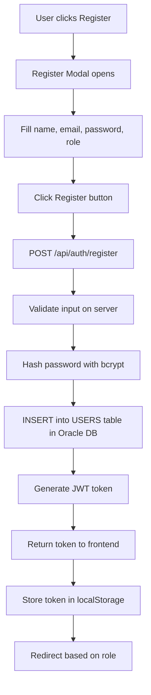

---

### 1.2 User Login

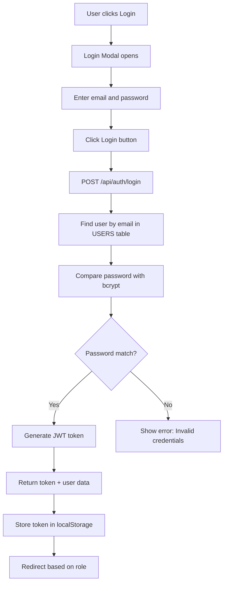

---

### 1.3 GitHub OAuth Login

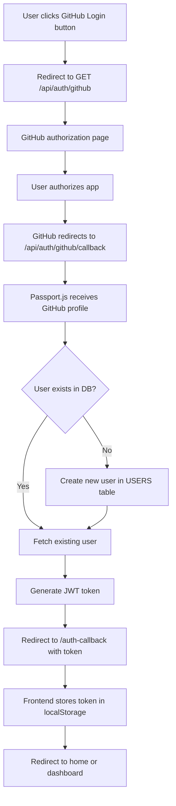

---

### 1.4 Role-Based Access Control

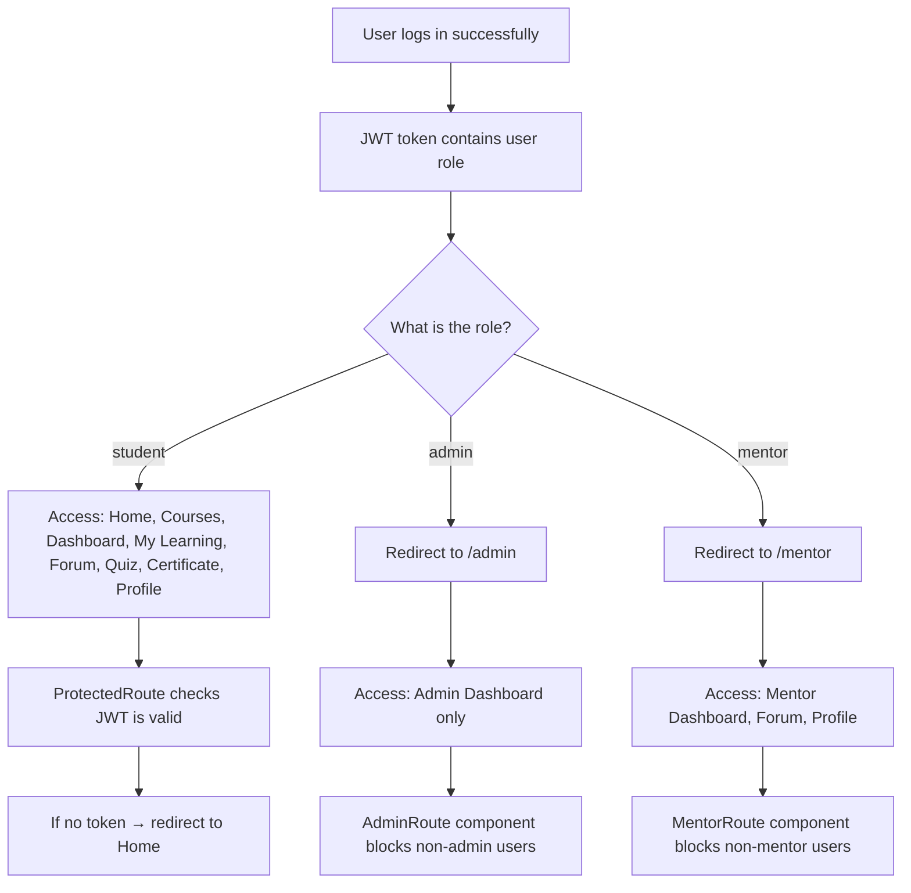

---

### 1.5 Navigation Bar

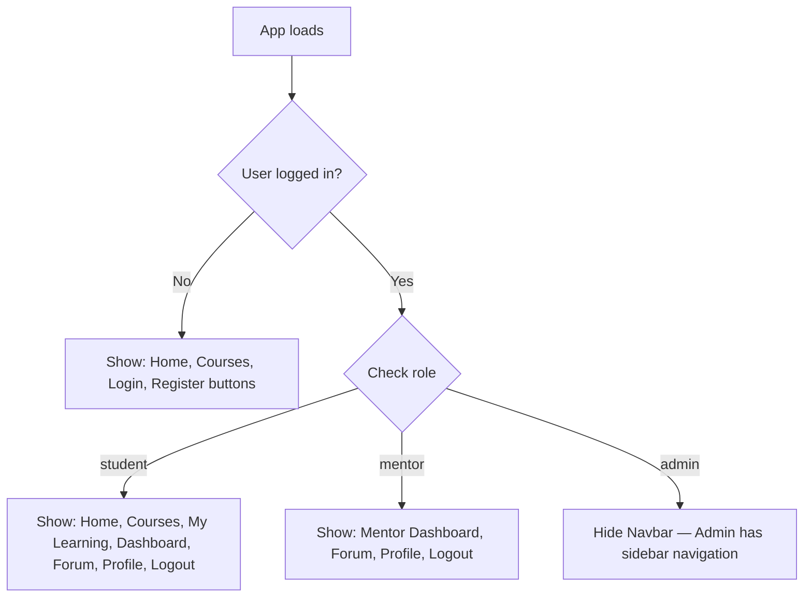

---
---

# SPRINT 2 — Course Catalog & Enrollment

> **Goal:** Course listing, detail view, search/filter, enrollment, video player  
> **Features:** 6

---

### 2.1 Browse Courses

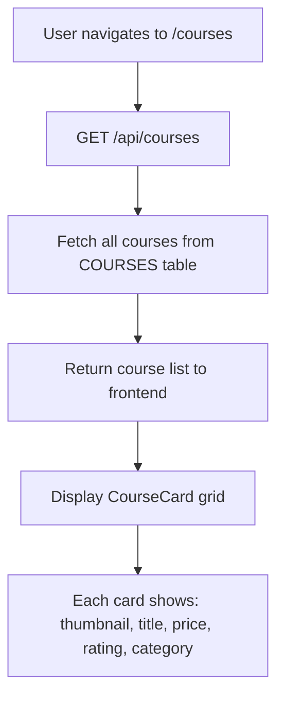

---

### 2.2 Search Courses

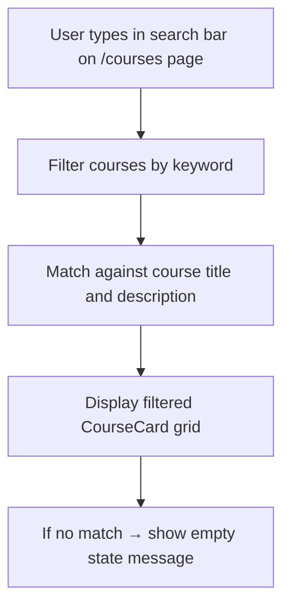

---

### 2.3 Filter Courses by Category

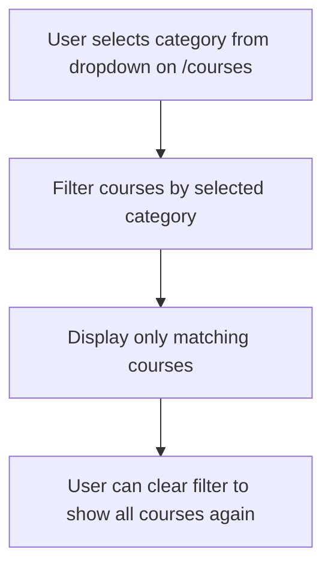

---

### 2.4 View Course Detail

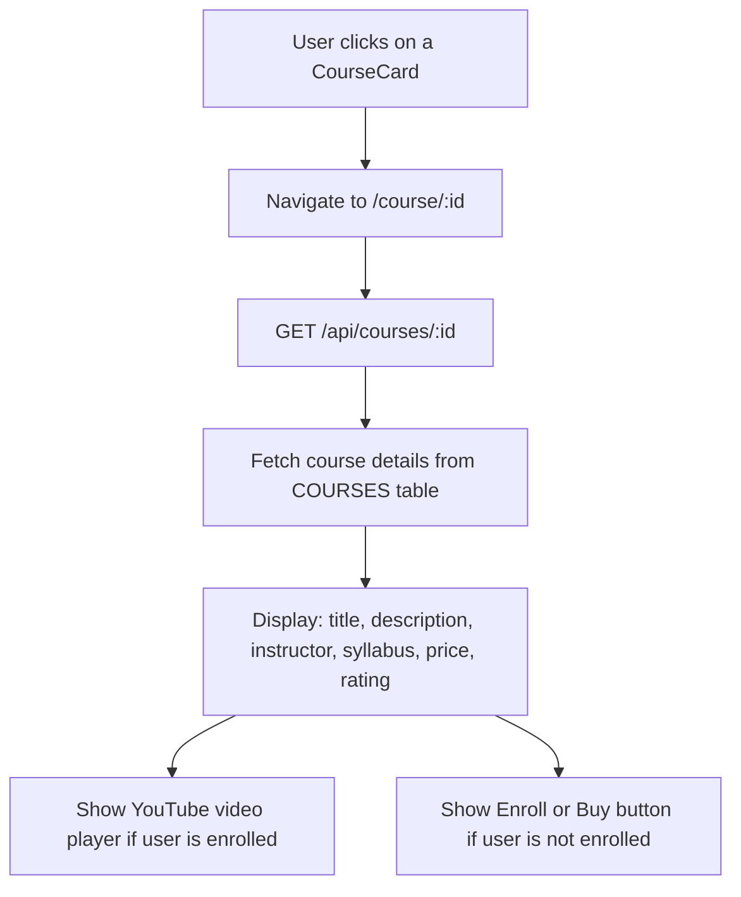

---

### 2.5 Enroll in Free Course

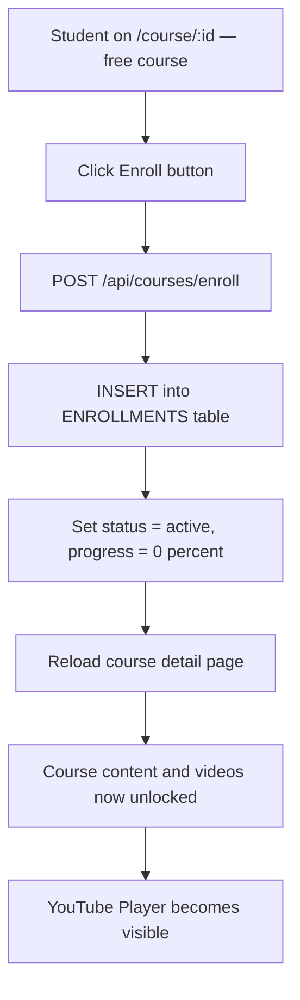

---

### 2.6 Home Page

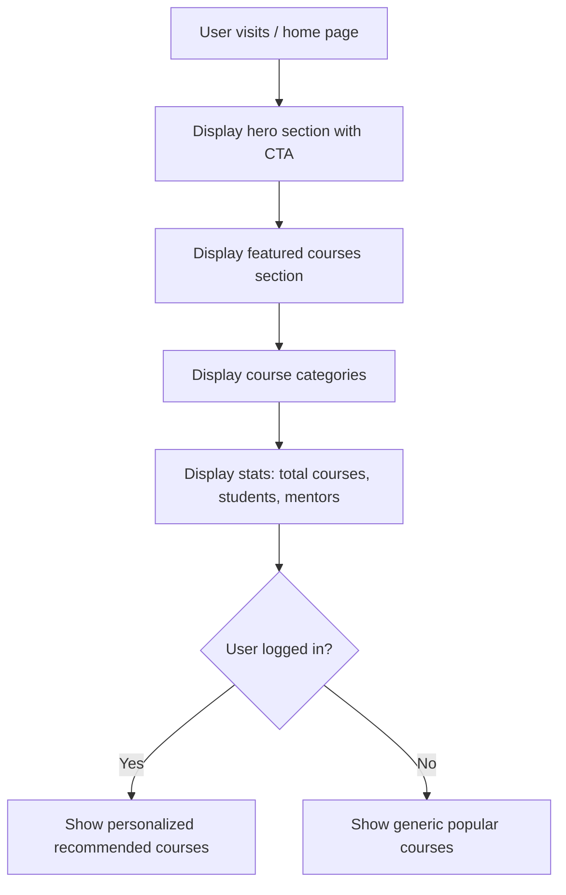

---
---

# SPRINT 3 — Payment & Progress Tracking

> **Goal:** Payment integration, enrollment linking, progress tracking, student dashboard  
> **Features:** 8

---

### 3.1 Pay for Course — Stripe

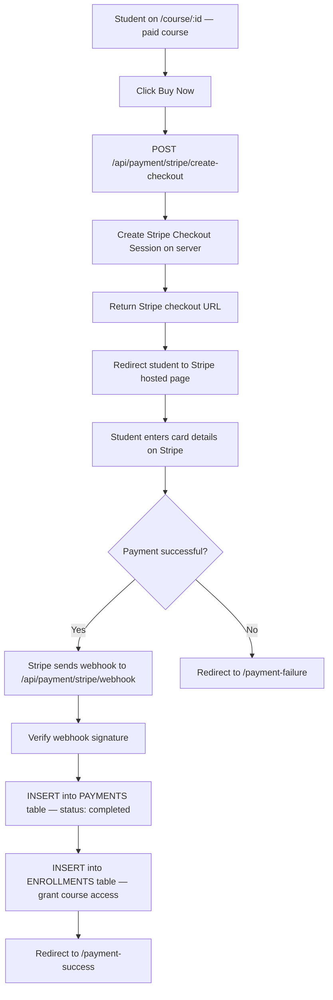

---

### 3.2 Pay for Course — Khalti

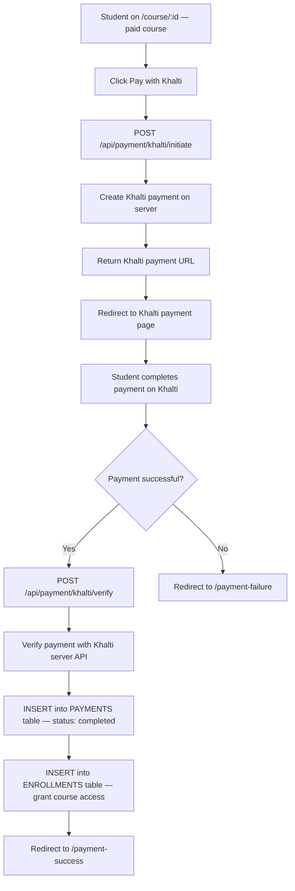

---

### 3.3 Payment Success Page

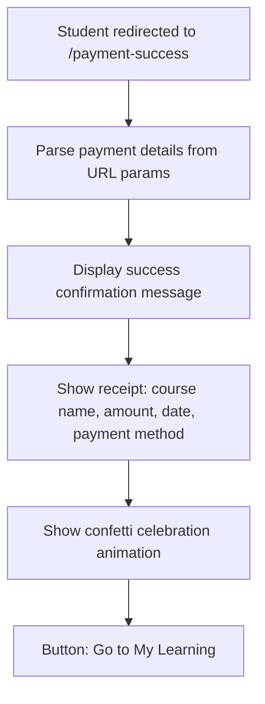

---

### 3.4 Payment Failure Page

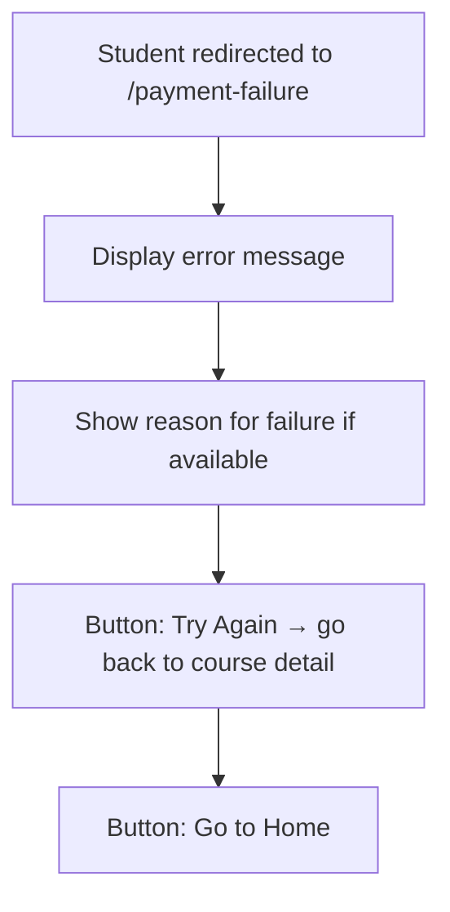

---

### 3.5 Track Course Progress

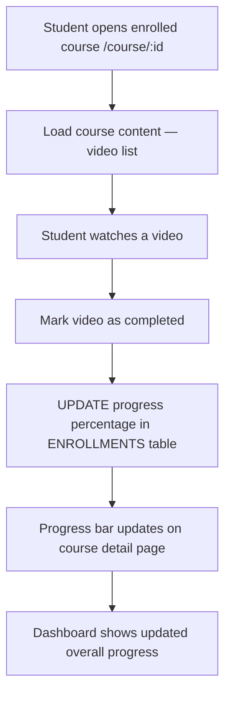

---

### 3.6 My Learning Page

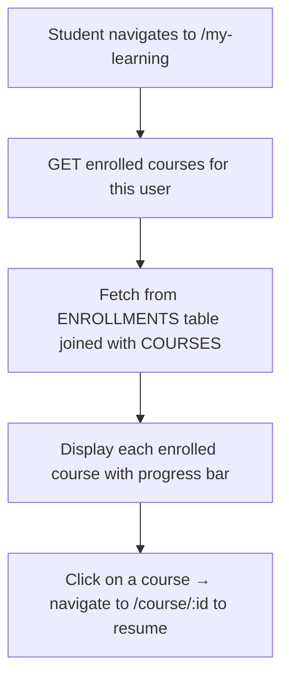

---

### 3.7 Purchased Courses Page

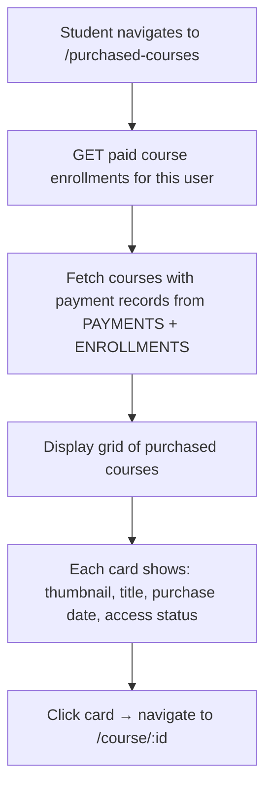

---

### 3.8 Student Dashboard

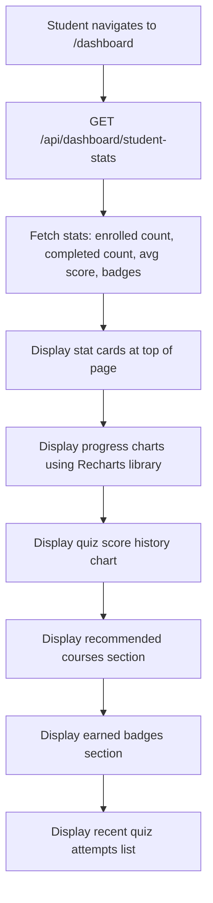

---
---

# SPRINT 4 — Quiz System & Forum

> **Goal:** Quiz creation, question bank, attempt recording, auto scoring, forum  
> **Features:** 7

---

### 4.1 Take a Quiz

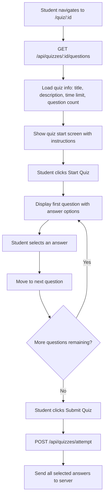

---

### 4.2 Auto Score Quiz

```mermaid
flowchart TD
    A[Server receives submitted quiz answers] --> B[Fetch correct answers from QUESTIONS table]
    B --> C[Compare each submitted answer to correct answer]
    C --> D[Calculate score = correct count / total questions]
    D --> E[INSERT attempt into QUIZ_ATTEMPTS table]
    E --> F[INSERT each individual answer into USER_ANSWERS table]
    F --> G[Return score and detailed results to frontend]
    G --> H[Display result screen: score percentage, pass/fail, correct answers review]
```

---

### 4.3 View Quiz History

```mermaid
flowchart TD
    A[Student on /dashboard page] --> B[Quiz History section visible]
    B --> C[GET quiz attempts for this user]
    C --> D[Fetch from QUIZ_ATTEMPTS table]
    D --> E[Display list: quiz name, score, date, pass/fail status]
    E --> F[Click on an attempt → view detailed answer breakdown]
```

---

### 4.4 Create Forum Post

```mermaid
flowchart TD
    A[User navigates to /forum] --> B[Click Create Post button]
    B --> C[Fill in form: title, body, category]
    C --> D[Click Submit]
    D --> E[POST /api/forum/posts]
    E --> F[INSERT into FORUM_POSTS table]
    F --> G[New post appears at top of forum list]
```

---

### 4.5 View Forum Post and Replies

```mermaid
flowchart TD
    A[User on /forum page] --> B[Click on a post title]
    B --> C[GET /api/forum/posts/:id]
    C --> D[Fetch post details + all replies from FORUM_REPLIES table]
    D --> E[Display full post: title, body, author name, date]
    E --> F[Display reply thread below the post]
```

---

### 4.6 Reply to Forum Post

```mermaid
flowchart TD
    A[User viewing a forum post detail] --> B[Type reply text in reply textarea]
    B --> C[Click Submit Reply button]
    C --> D[POST /api/forum/posts/:id/replies]
    D --> E[INSERT into FORUM_REPLIES table]
    E --> F[New reply appears in thread below the post]
```

---

### 4.7 Vote on Forum Post

```mermaid
flowchart TD
    A[User viewing forum post list or detail] --> B[Click upvote or downvote button on a post]
    B --> C[POST /api/forum/posts/:id/vote]
    C --> D{Has this user voted on this post before?}
    D -- Never voted --> E[INSERT new vote into FORUM_VOTES table]
    D -- Same vote again --> F[DELETE vote — toggle off]
    D -- Different vote --> G[UPDATE vote in FORUM_VOTES table]
    E --> H[Update displayed vote count]
    F --> H
    G --> H
```

---
---

# SPRINT 5 — Admin Course Management & Mentor Sessions

> **Goal:** Admin CRUD for courses, quiz management, mentor booking, video meetings  
> **Features:** 8

---

### 5.1 Admin — Create Course

```mermaid
flowchart TD
    A[Admin on /admin dashboard] --> B[Click Courses tab in sidebar]
    B --> C[Click Add Course button]
    C --> D[Fill form: title, description, category, price, thumbnail URL]
    D --> E[Click Create button]
    E --> F[POST /api/admin/courses]
    F --> G[INSERT into COURSES table in Oracle DB]
    G --> H[New course appears in admin course management list]
```

---

### 5.2 Admin — Update Course

```mermaid
flowchart TD
    A[Admin on /admin → Courses tab] --> B[Click Edit button on a course row]
    B --> C[Edit form opens pre-filled with existing course data]
    C --> D[Modify desired fields]
    D --> E[Click Update button]
    E --> F[PUT /api/admin/courses/:id]
    F --> G[UPDATE COURSES table in Oracle DB]
    G --> H[Course updated — changes visible in catalog]
```

---

### 5.3 Admin — Delete Course

```mermaid
flowchart TD
    A[Admin on /admin → Courses tab] --> B[Click Delete button on a course row]
    B --> C[Confirmation dialog appears]
    C --> D{User confirms deletion?}
    D -- Yes --> E[DELETE /api/admin/courses/:id]
    E --> F[DELETE from COURSES table]
    F --> G[Course removed from admin list and public catalog]
    D -- No --> H[Cancel — no action taken]
```

---

### 5.4 Admin — Create Quiz for Course

```mermaid
flowchart TD
    A[Admin on /admin → Quizzes tab] --> B[Click Add Quiz button]
    B --> C[Select a course to link the quiz to]
    C --> D[Enter quiz title and description]
    D --> E[Click Create Quiz button]
    E --> F[POST /api/admin/quizzes]
    F --> G[INSERT into QUIZZES table with course_id foreign key]
    G --> H[Quiz created and linked to selected course]
```

---

### 5.5 Admin — Add Question to Quiz

```mermaid
flowchart TD
    A[Admin on Quiz management section] --> B[Select a quiz from the list]
    B --> C[Click Add Question button]
    C --> D[Enter question text]
    D --> E[Enter 4 answer options A B C D]
    E --> F[Select which option is the correct answer]
    F --> G[Click Save Question]
    G --> H[POST /api/admin/quizzes/:id/questions]
    H --> I[INSERT into QUESTIONS table with quiz_id]
    I --> J[Question added to the quiz question bank]
```

---

### 5.6 Book Mentor Session

```mermaid
flowchart TD
    A[Student wants learning guidance] --> B[Browse list of available mentors]
    B --> C[Select a mentor]
    C --> D[Choose preferred date and time slot]
    D --> E[Click Book Session button]
    E --> F[POST /api/sessions/book]
    F --> G[INSERT into LIVE_SESSIONS table — status: pending]
    G --> H[Booking confirmation message shown to student]
    H --> I[Notification sent to the selected mentor]
```

---

### 5.7 Mentor — View and Manage Bookings

```mermaid
flowchart TD
    A[Mentor on /mentor dashboard] --> B[View list of booking requests]
    B --> C[Each booking shows: student name, date, time, current status]
    C --> D{Mentor chooses action}
    D -- Accept --> E[PUT /api/sessions/:id/accept]
    E --> F[UPDATE status = confirmed in LIVE_SESSIONS table]
    D -- Reject --> G[PUT /api/sessions/:id/reject]
    G --> H[UPDATE status = rejected in LIVE_SESSIONS table]
    F --> I[Session appears in mentor upcoming schedule]
```

---

### 5.8 Video Meeting — WebRTC

```mermaid
flowchart TD
    A[Scheduled session time arrives] --> B[Mentor or Student clicks Join Meeting button]
    B --> C[Frontend connects to Socket.IO server]
    C --> D[Emit join-room event with unique roomId]
    D --> E[Server broadcasts user-connected to all in room]
    E --> F[First peer sends WebRTC offer via Socket.IO]
    F --> G[Second peer receives the offer]
    G --> H[Second peer sends WebRTC answer back]
    H --> I[ICE candidates exchanged between peers]
    I --> J[Direct peer-to-peer video and audio connection established]
    J --> K[Live video call is now active]
    K --> L[Real-time chat messages via Socket.IO]
    K --> M[File sharing via Socket.IO]
    K --> N[Controls: mute audio, toggle camera, raise hand]
```

---
---

# SPRINT 6 — ML Recommendation Engine

> **Goal:** Build Python ML service, data collection, recommendation API, frontend integration  
> **Features:** 3

---

### 6.1 Collect User Interactions

```mermaid
flowchart TD
    A[Student uses the platform] --> B{What action?}
    B -- Views a course --> C[Record view interaction]
    B -- Enrolls in course --> D[Record enrollment interaction]
    B -- Completes a course --> E[Record completion interaction]
    B -- Takes a quiz --> F[Record quiz interaction]
    C --> G[INSERT into INTERACTIONS table]
    D --> G
    E --> G
    F --> G
    G --> H[Data available for ML model training]
```

---

### 6.2 ML Recommendation Engine

```mermaid
flowchart TD
    A[ML Service — Python Flask app on port 5001] --> B[Load interaction data from Oracle DB]
    B --> C[recommendation.py processes data]
    C --> D[Apply collaborative filtering algorithm]
    D --> E[Generate ranked list of recommended course IDs per user]
    E --> F[Expose endpoint: GET /recommend/:userId]
    G[retrain.py script] --> H[Periodically retrain the model with fresh data]
    H --> D
```

---

### 6.3 Display Recommendations on Frontend

```mermaid
flowchart TD
    A[Student visits /dashboard or / home or /course/:id] --> B[Frontend calls GET /api/recommendations/:userId]
    B --> C[Node.js backend proxies request to ML service on port 5001]
    C --> D[ML service returns list of recommended course IDs]
    D --> E[Backend fetches full course details for those IDs]
    E --> F[Return course data to frontend]
    F --> G[Dashboard shows: Recommended for You section]
    F --> H[Course page shows: Similar Courses section]
    F --> I[Home page shows: Personalized Suggestions section]
```

---
---

# SPRINT 7 — Payment Finalization & Reports

> **Goal:** Payment flow polish, admin payment reports, payment state handling  
> **Features:** 3

---

### 7.1 Store Payment Records

```mermaid
flowchart TD
    A[Payment completed via Stripe or Khalti] --> B[Server receives confirmation]
    B --> C[INSERT into PAYMENTS table]
    C --> D[Store: user_id, course_id, amount, method, status, date]
    D --> E{Payment status}
    E -- completed --> F[Payment record saved as successful]
    E -- failed --> G[Payment record saved as failed]
    E -- pending --> H[Payment record saved as pending]
    F --> I[Available in admin payment reports]
```

---

### 7.2 Link Payment to Enrollment

```mermaid
flowchart TD
    A[Payment status = completed] --> B[Check if enrollment already exists]
    B --> C{Enrollment exists?}
    C -- No --> D[INSERT into ENROLLMENTS table]
    D --> E[Set status = active, progress = 0 percent]
    C -- Yes --> F[UPDATE enrollment status = active]
    E --> G[Student now has full access to course content]
    F --> G
    G --> H[Student can watch videos, take quizzes]
```

---

### 7.3 Admin — Payment Reports

```mermaid
flowchart TD
    A[Admin on /admin dashboard] --> B[Click Payments tab in sidebar]
    B --> C[Fetch all payment records from PAYMENTS table]
    C --> D[Display table: student name, course, amount, method, status, date]
    D --> E[Show stats: total revenue, transaction count, avg amount]
    E --> F[Chart: revenue over time — line or area chart]
    F --> G[Chart: payment method split — Stripe vs Khalti pie chart]
```

---
---

# SPRINT 8 — Badges, Certificates & Course Ratings

> **Goal:** Badge system, certificate generation, verification, course ratings  
> **Features:** 7

---

### 8.1 Earn Badges

```mermaid
flowchart TD
    A[Student completes an achievement milestone] --> B{Check which badge rule is triggered}
    B -- First course completed --> C[Assign: First Course badge]
    B -- 5 courses completed --> D[Assign: Dedicated Learner badge]
    B -- Quiz score above 90 percent --> E[Assign: Quiz Master badge]
    B -- All course quizzes passed --> F[Assign: Perfect Scorer badge]
    C --> G[INSERT into USER_BADGES table]
    D --> G
    E --> G
    F --> G
    G --> H[Badge displayed on /profile page and /dashboard]
```

---

### 8.2 Generate Certificate

```mermaid
flowchart TD
    A[Student completes a course — 100 percent progress] --> B[System detects completion automatically]
    B --> C[Generate unique certificate ID string]
    C --> D[Create certificate record in database]
    D --> E[Store: student name, course name, completion date, unique ID]
    E --> F[Certificate becomes available on /certificate page]
```

---

### 8.3 View and Download Certificate

```mermaid
flowchart TD
    A[Student navigates to /certificate] --> B[Fetch certificates for this user]
    B --> C[Display certificate with: student name, course name, date, unique ID]
    C --> D[Beautiful certificate design rendered on screen]
    D --> E{What does student want to do?}
    E -- Download --> F[Generate PDF version of certificate]
    F --> G[PDF file downloads to student device]
    E -- Share --> H[Copy unique verification link to clipboard]
```

---

### 8.4 Verify Certificate

```mermaid
flowchart TD
    A[Anyone visits verification URL with certificate ID] --> B[GET /api/certificates/verify/:certId]
    B --> C[Look up certificate ID in database]
    C --> D{Certificate found?}
    D -- Yes --> E[Display: student name, course name, completion date]
    E --> F[Show green Verified — Authentic badge]
    D -- No --> G[Show red error: Certificate not found — Invalid]
```

---

### 8.5 Rate a Course

```mermaid
flowchart TD
    A[Student on enrolled course page /course/:id] --> B[Click star rating widget — select 1 to 5 stars]
    B --> C[POST /api/courses/:id/rate]
    C --> D[INSERT or UPDATE rating in COURSE_RATINGS table]
    D --> E[Server recalculates average rating for this course]
    E --> F[Return new average rating to frontend]
    F --> G[Star rating display updates on course page]
```

---

### 8.6 Display Average Rating

```mermaid
flowchart TD
    A[Any user views course detail /course/:id] --> B[Course data includes avg_rating field]
    B --> C[Display filled star icons based on average]
    C --> D[Show numeric average next to stars]
    D --> E[Show total number of ratings count]
    E --> F[Same average rating also shown on CourseCard in /courses listing]
```

---

### 8.7 Course Completion Logic

```mermaid
flowchart TD
    A[Student watches all videos in a course] --> B[Each video marked complete updates progress]
    B --> C[Progress reaches 100 percent]
    C --> D[UPDATE enrollment status = completed in ENROLLMENTS table]
    D --> E[Trigger badge check — see 8.1]
    D --> F[Trigger certificate generation — see 8.2]
    D --> G[Update student dashboard stats]
```

---
---

# SPRINT 9 — Admin Reports, Notifications & Password Reset

> **Goal:** Admin analytics dashboards, email notifications, password reset, mentor rating  
> **Features:** 7

---

### 9.1 Admin — User Reports

```mermaid
flowchart TD
    A[Admin on /admin dashboard] --> B[Click Users tab in sidebar]
    B --> C[GET /api/admin/users or /api/dashboard/stats]
    C --> D[Fetch all users from USERS table]
    D --> E[Display user table: name, email, role, join date]
    E --> F[Show stats cards: total users, new sign-ups this month]
    F --> G[Pie chart: role distribution — students vs mentors vs admins]
    G --> H[Area chart: user growth over time]
```

---

### 9.2 Admin — Enrollment Reports

```mermaid
flowchart TD
    A[Admin on /admin dashboard] --> B[Click Enrollments tab in sidebar]
    B --> C[Fetch enrollment data from ENROLLMENTS + COURSES tables]
    C --> D[Display: total enrollments count, active courses, completion rate]
    D --> E[Bar chart: enrollments per course]
    E --> F[Trend line: enrollment growth over time]
```

---

### 9.3 Admin — Quiz Analytics

```mermaid
flowchart TD
    A[Admin on /admin dashboard] --> B[Click Quizzes tab in sidebar]
    B --> C[Fetch quiz data from QUIZ_ATTEMPTS + QUIZZES tables]
    C --> D[Display: total attempts, overall pass rate, average score]
    D --> E[Chart: score distribution histogram]
    E --> F[Chart: course-wise quiz performance comparison]
```

---

### 9.4 Password Reset

```mermaid
flowchart TD
    A[User on Login Modal] --> B[Click Forgot Password link]
    B --> C[Enter email address in reset form]
    C --> D[Click Send Reset Link button]
    D --> E[POST /api/auth/forgot-password]
    E --> F[Server generates unique reset token]
    F --> G[Store reset token in DB with expiry timestamp]
    G --> H[Send email with reset link via emailService.js]
    H --> I[User opens email and clicks reset link]
    I --> J[Open password reset form in browser]
    J --> K[Enter new password and confirm]
    K --> L[POST /api/auth/reset-password with token]
    L --> M[Validate token is not expired]
    M --> N[Hash new password with bcrypt]
    N --> O[UPDATE password in USERS table]
    O --> P[Show success message — redirect to login]
```

---

### 9.5 Email Notifications

```mermaid
flowchart TD
    A[A trigger event occurs in the system] --> B{What type of event?}
    B -- New enrollment --> C[Compose enrollment confirmation email]
    B -- Quiz completed --> D[Compose quiz result email with score]
    B -- Mentor session booked --> E[Compose booking confirmation email]
    B -- Payment completed --> F[Compose payment receipt email]
    C --> G[emailService.js called]
    D --> G
    E --> G
    F --> G
    G --> H[Nodemailer sends email via configured SMTP]
    H --> I[Email delivered to user inbox]
```

---

### 9.6 Mentor Rating

```mermaid
flowchart TD
    A[Student completes a mentor session] --> B[Rating prompt appears]
    B --> C[Student selects 1 to 5 stars]
    C --> D[POST /api/sessions/:id/rate]
    D --> E[INSERT into SESSION_RATINGS table]
    E --> F[Server calculates average rating for this mentor]
    F --> G[Updated rating displayed on mentor profile and listing]
```

---

### 9.7 User Profile Page

```mermaid
flowchart TD
    A[User navigates to /profile] --> B[GET /api/users/profile]
    B --> C[Fetch user data from USERS table]
    C --> D[Display: avatar image, full name, email, role, join date]
    D --> E[Display earned badges section with badge icons]
    E --> F[Display stats: courses enrolled, courses completed, average quiz score]
    F --> G[Option to upload or change profile picture]
```

---
---

# SPRINT 10 — Deployment, Testing & Documentation

> **Goal:** Production deployment, testing, final documentation, project sign-off  
> **Features:** 6

---

### 10.1 Production Build

```mermaid
flowchart TD
    A[Development complete] --> B[Run: npm run build in frontend]
    B --> C[Vite generates optimized static files in dist/ folder]
    C --> D[HTML, CSS, JS bundles minified]
    D --> E[Static assets ready for deployment]
```

---

### 10.2 Backend Environment Configuration

```mermaid
flowchart TD
    A[Prepare backend for production] --> B[Set NODE_ENV = production in .env]
    B --> C[Configure production Oracle DB connection string]
    C --> D[Set secure session secret]
    D --> E[Update CORS origins for production domain]
    E --> F[Configure Stripe and Khalti production API keys]
    F --> G[Backend ready for production deployment]
```

---

### 10.3 Deployment

```mermaid
flowchart TD
    A[Production build ready] --> B[Choose hosting platform]
    B --> C[Upload backend to server]
    C --> D[Upload frontend dist/ to static hosting or same server]
    D --> E[Configure reverse proxy — Nginx or similar]
    E --> F[Set up SSL certificate for HTTPS]
    F --> G[Start backend with PM2 or similar process manager]
    G --> H[Verify all API endpoints respond correctly]
    H --> I[Verify frontend loads and connects to backend]
    I --> J[Application is live]
```

---

### 10.4 Regression Testing

```mermaid
flowchart TD
    A[Application deployed] --> B[Test user registration flow]
    B --> C[Test login and OAuth flow]
    C --> D[Test course browsing and enrollment]
    D --> E[Test payment flow end to end]
    E --> F[Test quiz taking and scoring]
    F --> G[Test forum post and reply]
    G --> H[Test mentor session booking]
    H --> I[Test certificate generation]
    I --> J[Test admin dashboard features]
    J --> K{All tests pass?}
    K -- Yes --> L[Ready for sign-off]
    K -- No --> M[Log bugs and fix critical issues]
    M --> B
```

---

### 10.5 Security Checks

```mermaid
flowchart TD
    A[Security audit begins] --> B[Verify JWT token validation on all protected routes]
    B --> C[Verify role-based access control blocks unauthorized access]
    C --> D[Verify input validation on all API endpoints]
    D --> E[Verify SQL injection protection — parameterized queries]
    E --> F[Verify password hashing with bcrypt]
    F --> G[Verify payment webhook signature verification]
    G --> H[Verify CORS configuration is restrictive]
    H --> I[Security checklist complete]
```

---

### 10.6 Project Sign-Off

```mermaid
flowchart TD
    A[All testing complete] --> B[Final documentation written]
    B --> C[User manual prepared]
    C --> D[SRS document updated]
    D --> E[All screenshots captured for report]
    E --> F[Final demo prepared]
    F --> G[Present to supervisor]
    G --> H[Project signed off and submitted]
```
